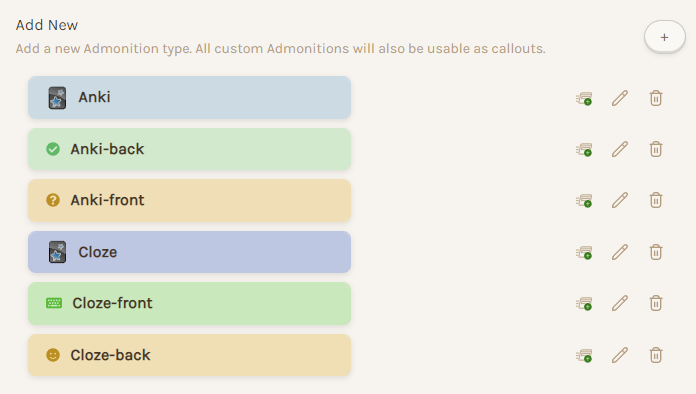
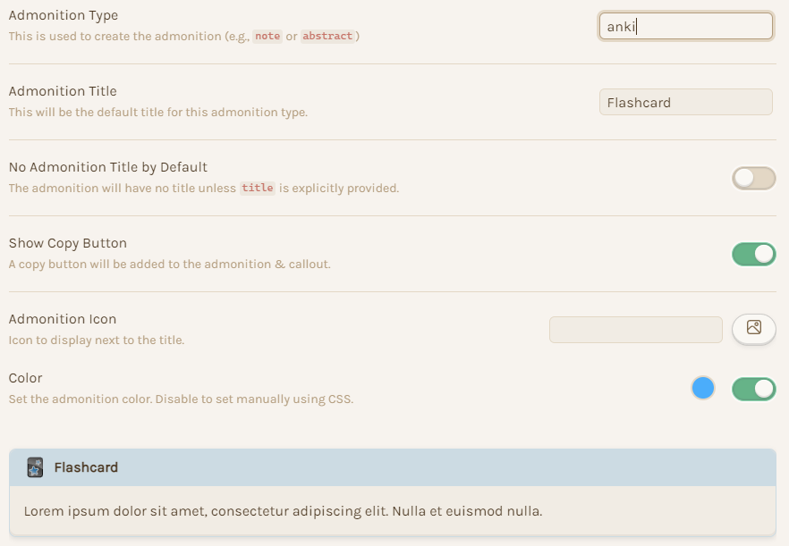
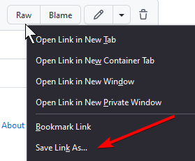
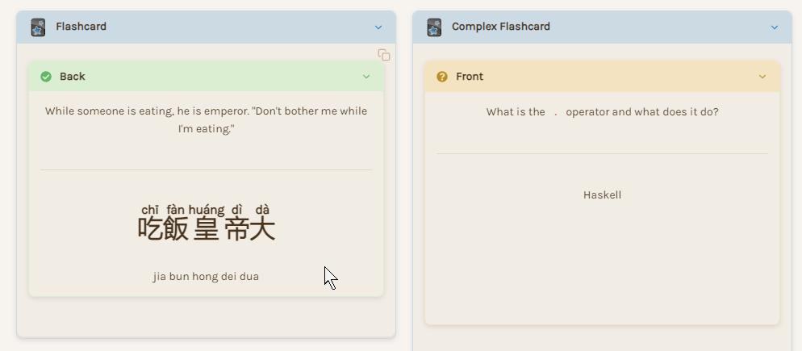

[^1]

# 🃏 Obsidiflip Readme

Interactive Obsidian-Anki flashcards that flip and fade using CSS and two plugins.

## 📜 Features
- Works in Live Preview and reading mode.
- Multi-line fields and custom note types supported.
- Cloze supported, with optional tradeoff of cleanliness for cloze numbering.
- Multiple flashcards arranged in a row in reading mode. Customizable min and max width.

## 🎥 Demo
<video src="https://user-images.githubusercontent.com/47987424/192072673-1e385f7c-cc1b-479c-b805-4f15c49d2836.mp4" controls autoplay loop muted >
  Your browser does not support the video tag. See `assets/obsidiflip-demo.mp4`.
</video>

## 📑 Table of Contents
- [📜 Features](#-features)
- [🎥 Demo](#-demo)
- [📑 Table of Contents](#-table-of-contents)
- [💿 Prerequisites](#-prerequisites)
- [🧑‍💻 Installation and Usage](#-installation-and-usage)
  - [📞 Admonition Plugin Settings](#-admonition-plugin-settings)
  - [🪟 CSS](#-css)
  - [🪨 Obsidian to Anki Plugin Settings](#-obsidian-to-anki-plugin-settings)
    - [Cloze settings](#cloze-settings)
      - [Highlight option](#highlight-option)
      - [Uglier, but more flexible option](#uglier-but-more-flexible-option)
    - [🎴 Regex and corresponding sample flashcards](#-regex-and-corresponding-sample-flashcards)
      - [General Principles](#general-principles)
      - [Forward (Basic)](#forward-basic)
      - [Revealed Context](#revealed-context)
      - [Basic Anking](#basic-anking)
      - [Complex](#complex)
      - [Cloze](#cloze)
      - [Cloze Write](#cloze-write)
    - [🖼️ Modding the plugin to support images](#️-modding-the-plugin-to-support-images)
- [🎨 Customization](#-customization)
  - [Custom card types](#custom-card-types)
  - [Card width](#card-width)
  - [Show front and back admonition title bar](#show-front-and-back-admonition-title-bar)
- [💥 Troubleshooting](#-troubleshooting)
  - [Note type not showing](#note-type-not-showing)
  - [Wrong field order](#wrong-field-order)

## 💿 Prerequisites

Please have these apps and plugins installed and working.
- [Obsidian](https://obsidian.md/)
- [Anki](https://apps.ankiweb.net/)
- Obsidian Plugins
	- [Obsidian to Anki](https://github.com/Pseudonium/Obsidian_to_Anki)
		- Requires Anki plugin [Anki Connect](https://ankiweb.net/shared/info/2055492159)
	- [Obsidian Admonition](https://github.com/valentine195/obsidian-admonition)
- Highly recommended: a text expander like [espanso](https://espanso.org/)

## 🧑‍💻 Installation and Usage

### 📞 Admonition Plugin Settings

In the admonition plugin settings, please add these 6 admonition types. Feel free to customize the title, title display option, copy button, icon, and color, but don't change the admonition type unless you plan to modify the CSS and regex.



| Flip Card    | Fade Card     |
| ------------ | ------------- |
| `anki`       | `cloze`       |
| `anki-front` | `cloze-front` |
| `anki-back`  | `cloze-back`  |




### 🪟 CSS

1. Go to Settings -> Appearance -> CSS Snippets and open your CSS Snippet folder.
2. Click `obsidiflip.css` in this repository, right click raw, and save as
   


3. Save `obsidiflip.css` to your snippets folder, refresh the CSS settings, and enable it.

### 🪨 Obsidian to Anki Plugin Settings

#### Cloze settings

##### Highlight option
1. Enable the CurlyCloze option.
2. Enable the Curlycloze -> Highlights to Clozes option.
- Clozes must be in the highlight syntax for the fade cloze cards to work properly. This unfortunately means no support for cloze field numbering.

##### Uglier, but more flexible option
This enables cloze numbering, but will highlight all clozes in Anki and will look messier in Obsidian.
1. Enable the CurlyCloze option.
2. Format clozes like this `=={1:cloze text}==` while making sure the Curlycloze -> Highlights to Clozes option is **disabled** (since the CSS relies on the highlight for fading in and out).
   1. Please refer to the [CurlyCloze documentation](https://github.com/Pseudonium/Obsidian_to_Anki/wiki/Cloze-formatting) for formatting options

- If you want to use an element other than highlights such as _italics_ or **bold**, you have to edit the CSS. Look for replacing the `mark` tag.


#### 🎴 Regex and corresponding sample flashcards

[Skip to next section](#modding-the-plugin-to-support-images)

[Skip to cloze cards](#cloze)

Please let me know in github issues if any of the regex isn't working properly or has compatibility issues.

##### General Principles

1. Please use a text expander like [espanso](https://espanso.org/) (and set `force_clipboard: true`)! Typing the templates in manually is slow.
2. Flip cards always contain `ad-anki-front` and `ad-anki-back`
3. I use horizontal rules with asterisks (`***`) to separate fields on the same card face. Horizontal rules with dashes will unintentionally create h2 headings.
4. Card types are identified by a comment on its own line after `ad-anki` and before `ad-anki-front`. Ex. `%%anki-forward%%`
   1. Admonition plugin options, like title, can be set before this comment
5. Field order in Anki must be the same as the regex capture group order. See [Field Order Troubleshooting](#wrong-field-order) for details.

##### Forward (Basic)

This is a basic card with only front and back fields

###### Markdown

``````
`````ad-anki
%%anki-forward%%

````ad-anki-front
Front
````

````ad-anki-back
Back
````
`````
``````

###### Regex

``````
`````ad-anki[\s\S]+?%%anki-forward%%[\s\S]+?````ad-anki-front\n([\s\S]*?)````[\s\S]+?````ad-anki-back\n([\s\S]*?)````
``````


##### Revealed Context

This is a personal forward and reversed card. It shows revealed context on the back of the card (such as sentences in a foreign language) in both forward and reversed mode.

###### Markdown
``````
`````ad-anki
%%anki-revealed-context%%

````ad-anki-front
Front
````

````ad-anki-back
Back
***
Revealed Context
````
`````
``````

###### Regex
``````
`````ad-anki[\s\S]+?%%anki-revealed-context%%[\s\S]+?````ad-anki-front\n([\s\S]*?)````[\s\S]+?````ad-anki-back\n([\s\S]*?)(?:\*\*\*\n([\s\S]*?))?````
``````

##### Basic Anking

On request by reddit user [opendoorz](https://old.reddit.com/user/openingdoorz).

###### Markdown
``````
`````ad-anki
%%anki-basic-anking%%

````ad-anki-front
front
````

````ad-anki-back
back
***
personal notes
***
missed questions
````

`````
``````

###### Regex

``````
`````ad-anki[\s\S]+?%%anki-basic-anking%%[\s\S]+?````ad-anki-front\n([\s\S]*?)````[\s\S]+?````ad-anki-back\n([\s\S]*?)(?:\*\*\*\n([\s\S]*?))?(?:\*\*\*\n([\s\S]*?))?````
``````

##### Complex

I don't actually use this card. It's for demo purposes to show the flexibility of the format. The last `***` is necessary to  keep the id within `ad-anki` and allow for flashcards appearing next to each other.

###### Markdown

``````
`````ad-anki
title:Complex Flashcard
%%anki-complex%%

````ad-anki-front
this is the front of the card
***
this context should show up on the front of the card
````

````ad-anki-back
this is the back of the card
***
this context should show up on the back of the card
````
this shows up on both sides
***
`````
``````

###### Regex

``````
`````ad-anki[\s\S]+?%%anki-complex%%[\s\S]+?````ad-anki-front\n([\s\S]*?)(?:\*\*\*\n([\s\S]*?))?````[\s\S]+?````ad-anki-back\n([\s\S]*?)(?:\*\*\*\n([\s\S]*?))?````\n([\s\S]*?)\*\*\*\n
``````

##### Cloze

A basic cloze card with some context

###### Markdown
``````
`````ad-cloze
%%anki-cloze%%

````ad-cloze-front
This is a ==cloze== card
````

````ad-cloze-back
Here is some extra context
````
`````
``````

###### Regex

``````
`````ad-cloze[\s\S]+?%%anki-cloze%%[\s\S]+?````ad-cloze-front\n([\s\S]*?)````[\s\S]+?````ad-cloze-back\n([\s\S]*?)````\n
``````

##### Cloze Write

My custom cloze card with a question field, and you type in the answers.

###### Markdown
``````
`````ad-cloze
%%anki-cloze-write%%
````ad-cloze-front
Write your question here
***
This is a ==cloze== card with ==two== fields.
````
````ad-cloze-back
Here is some extra context
````
`````
``````

###### Regex

``````
^`````ad-cloze$[\s\S]+?^%%anki-cloze-write%%$[\s\S]+?^````ad-cloze-front$\n([\s\S]*?)\*\*\*\n([\s\S]*?)^````$[\s\S]+?^````ad-cloze-back$\n([\s\S]*?)^````$\n
``````

#### 🖼️ Modding the plugin to support images

Unfortunately the Obsidian to Anki plugin hasn't seen any updates in a while, so we need to edit it to support images ([see this issue](https://github.com/Pseudonium/Obsidian_to_Anki/issues/245)). Open `main.js` in your favorite editor, and comment out the `getAndFormatMedias` function (as backup). Add this right under it:

```js
    getAndFormatMedias(note_text) {
      // By Jeff Chiou thanks to TobiasKlosek's code https://github.com/Pseudonium/Obsidian_to_Anki/issues/245
      // TODO: support image resize format (ex. ![[og-image.png|200]])
      // PLAN: create escaped regex pattern for images and audio to capture link and size separately. Add style tag to .
      let hasAudio = AUDIO_EXTS.some(ext => note_text.includes(ext));
      let hasImage = IMAGE_EXTS.some(ext => note_text.includes(ext));

      if (hasAudio || hasImage) {
        let matches = note_text.match(/\!\[\[(.*)\]\]/g);
        matches.forEach(match => {          
          let link = match.substring(3, match.length - 2);

          this.detectedMedia.add(link);
          if (AUDIO_EXTS.includes(path.extname(link))) {
            note_text = note_text.replace(new RegExp(escapeRegex(match), "g"), "[sound:" + path.basename(link) + "]");
          }
          else if (IMAGE_EXTS.includes(path.extname(link))) {
            note_text = note_text.replace(new RegExp(escapeRegex(match), "g"), '');
          }
          else {
            console.warn("Unsupported extension: ", path.extname(link));
          }
        });
      }
      return note_text;
    }
```

I have plans to mod the plugin further but it is GPL licensed and this repo is MIT, so I might make a new repo so I can include a `main.js` file.[^2]

## 🎨 Customization

### Custom card types

See the [General Principles](#general-principles) section for custom card types.


### Card width
If you want to see more or fewer flashcards next to each other you can either adjust your readable line length or the min width and max width here:
```css
.admonition-anki-parent {
    display: inline-grid;
    margin: 10px;
    min-width: 230px;
    max-width: 471px;
}
```

See [this custom line length CSS](https://old.reddit.com/r/ObsidianMD/comments/s55zcw/how_to_have_a_custom_line_width/inkkqop/) from [knappsacks](https://old.reddit.com/user/knappsacks). Readable line length needs to be enabled.

### Show front and back admonition title bar



If you like this aesthetic better you can comment out / remove these lines from the css:
```css
.admonition-anki-front, .admonition-anki-back {
    padding: 0;
    border: 0;
    box-shadow: none !important;
}

.admonition-anki-front .admonition-content, .admonition-anki-back .admonition-content {
    border: none !important;
    padding: 0;
}
.admonition-anki-front .admonition-title, .admonition-anki-back .admonition-title {
    display: none;
}
```

## 💥 Troubleshooting

### Note type not showing

If your note type isn't showing under the obsidian to anki plugin settings, you have to either uninstall and reinstall the plugin, add the note types manually, or mod the plugin using [this commit](https://github.com/Pseudonium/Obsidian_to_Anki/pull/301). See [this issue](https://github.com/Pseudonium/Obsidian_to_Anki/issues/252) for details.

### Wrong field order

If your fields aren't in the right order, do this:
1. Close Obsidian
2. Reposition the fields in Anki with Tools -> Manage Note Types -> Fields -> Reposition. This requires a deck re-sync.
3. In the Obsidian-to-Anki plugin folder, look at `data.json` and the `fields_dict` section. Reorder the fields here for your note type and save and close.
4. Reopen Obsidian and do an Obsidian-to-Anki sync.
5. Reopen `data.json` and double check the field order is correct.

[^1]: Generated by Stable Diffusion locally on my laptop RTX 3080. Prompt was a variant of "thin shiny sharp black obsidian flashcards with shiny gold neurons on the front."

[^2]: I don't have the resources and knowledge to support a full fork yet.
